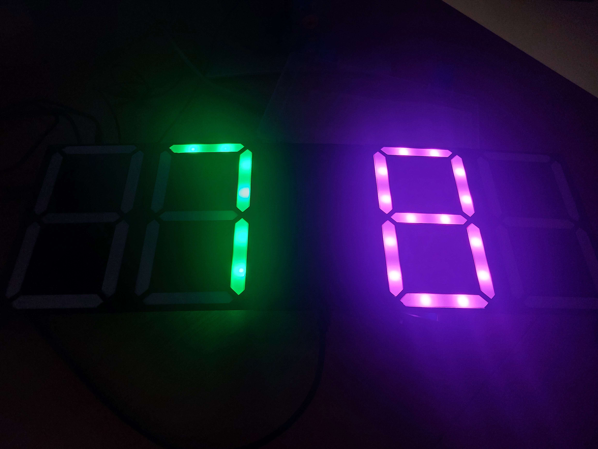

# RoboCup Junior Soccer ScoreBoard

⚙️ Hardware Overview

- The scoreboard consists of four 7-segment digits, where each segment is composed of two WS2812B addressable RGB LEDs. The segments are controlled via custom logic to display real-time score updates   during Robocup Junior Soccer matches.
  

📡 Connectivity & Configuration

  - Upon startup, the scoreboard attempts to connect to a predefined Wi-Fi network.

  - If the connection fails, it creates a Wi-Fi Access Point (AP) with password 12345678 and with a built-in configuration portal available at http://192.168.4.1.

  - From this portal, users can input new Wi-Fi credentials for future automatic connection.

  - The AP mode can also be triggered manually by holding the button for 5 seconds.
  

  🔄 Score Updates

  - The scoreboard receives score updates from an MQTT server, which are published by a mobile application.

  - Each team’s score is color-coded for visual distinction, enhancing readability during matches.

    
